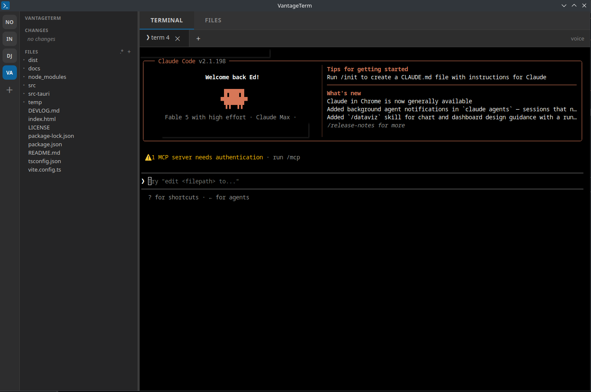
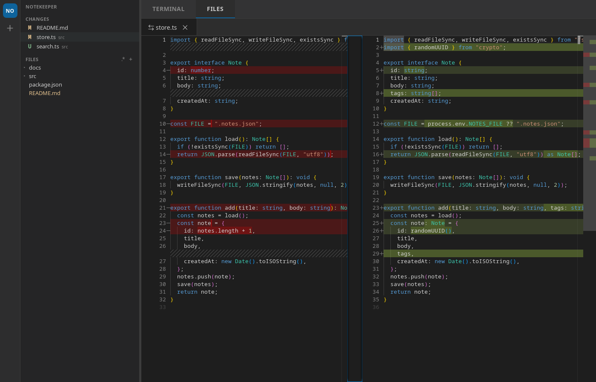

# VantageTerm

A lightweight desktop vantage point for working with Claude Code (or any CLI
agent): a multi-tab terminal, a file tree with git status, and VS Code-quality
file viewing and side-by-side diffs, without the weight of a full IDE.



The idea: keep your terminal front and center where the agent does its work,
and make reviewing what changed (files and diffs) a click away, across several
projects at once.

Built with **Tauri 2** (Rust backend), **xterm.js** (terminals), and
**Monaco** (the viewer and diff editor VS Code itself uses).



*Reviewing a change as a side-by-side diff — the Monaco diff editor, with the
git Changes list in the sidebar.*

## Features

- **Project rail** — open several projects at once; each keeps its own
  terminals and open files running while you're elsewhere. Switch with one
  click. Open projects are remembered between runs.
- **Multi-tab terminals** — real ptys running your shell in the project root.
  Rename a tab from its right-click menu. Rendered to a canvas for speed.
  Alt-click moves the shell cursor to the click point (plain shell prompts
  only; full-screen apps like vim are left alone).
- **File tree with git status** — yellow = modified, green = added/untracked,
  red = deleted. Right-click for New File / New Folder / Rename / Delete.
  A sidebar toggle shows or hides dotfiles, remembered between runs.
- **Changes list** — every modified file for the active project; click one to
  open its diff against `HEAD`.
- **File viewing and light editing** — full syntax highlighting via Monaco.
  `Ctrl+S` saves. No LSP, no project-wide search: this is a viewer, not an IDE.
- **Side-by-side diffs** — the VS Code diff editor. The open diff auto-refreshes
  as files change on disk, so you can watch an agent's edits land live.

## Layout

The main area uses two-level tabs: a category bar (**Terminal** | **Files**)
with the active category's sub-tabs beneath it. The far-left rail switches
projects; the sidebar holds the git changes list and file tree. Each project
remembers which category and tab it was on. `Ctrl+`` flips to the Terminal
category.

## Requirements

- [Rust](https://rustup.rs/) (stable) and Cargo
- [Node.js](https://nodejs.org/) 18+ and npm
- Linux: WebKitGTK 4.1 and the usual Tauri build deps — see the
  [Tauri prerequisites](https://tauri.app/start/prerequisites/)

## Development

```bash
npm install
npm run tauri dev            # opens your remembered projects
                             # (first run: the folder it was launched from)
```

## Build a standalone binary

For a fast-starting, self-contained app (no npm, no dev server), build in
release mode — Tauri embeds the frontend into the binary:

```bash
npm run tauri build                     # lean build
npm run tauri build -- --features stt   # include local voice input
```

The binary lands at `src-tauri/target/release/vantageterm`.

## Install as a command

Put it on your `PATH` so `vantageterm` works from any directory:

```bash
ln -sf "$PWD/src-tauri/target/release/vantageterm" ~/.local/bin/vantageterm
```

(Make sure `~/.local/bin` is on your `PATH`.) Then:

```bash
vantageterm              # open the current directory as a project
vantageterm ~/some/repo  # open a specific folder
```

Because it's a symlink into `target/`, rebuilding picks up the new binary
automatically. Note that `cargo clean` removes the binary until you rebuild; for
a copy that survives cleans, use `cp` instead of `ln -sf`.

## Voice input (optional, fully local)

VantageTerm can transcribe speech into the active terminal so you can dictate to
a CLI agent. It's **off by default** and gated behind a Cargo feature, so the
normal build stays lean and pulls in no audio/ML dependencies. When enabled,
transcription runs entirely on your machine (whisper.cpp) — your audio never
leaves the device.

Enable it at build time:

```bash
# dev
npm run tauri dev -- --features stt
# release
npm run tauri build -- --features stt
```

You also need the Whisper model weights on disk (a one-time download of the
weights file, *not* your audio going anywhere). Place a `ggml-*.bin` model in:

```
~/.local/share/vantageterm/models/
```

Models are available from the whisper.cpp project (e.g. `ggml-base.en.bin`,
~140 MB). With the feature compiled and a model present, a **voice** button
appears in the terminal tab strip: click to record, click again to transcribe;
the text is typed into the active terminal for you to review.

Model weights are never committed to the repo (see `.gitignore`).

## Project structure

```
src/                     Frontend (vanilla TypeScript + Vite)
  main.ts                Bootstrap and wiring
  projects.ts            Project rail, switching, persistence
  tabs.ts                Two-level, per-project tab manager
  term.ts                xterm.js terminals over ptys
  editors.ts             Monaco file + diff editors
  tree.ts                File tree with git decorations and file ops
  changes.ts             Git changes list and polling
  splitters.ts           Sidebar resize
  ui.ts                  Modal prompts / confirms / context menus
  ipc.ts                 Typed wrappers over Tauri commands
  stt.ts                 Voice input UI (active only with the `stt` feature)
src-tauri/src/main.rs     Rust backend: ptys, filesystem, git, folder picker
src-tauri/src/stt.rs      Optional local speech-to-text (`stt` feature)
```

## Status

Early and personal, but functional. Expect rough edges.

## License

Licensed under the Apache License, Version 2.0. See [LICENSE](LICENSE).

Copyright 2026 Edward Thomson.
